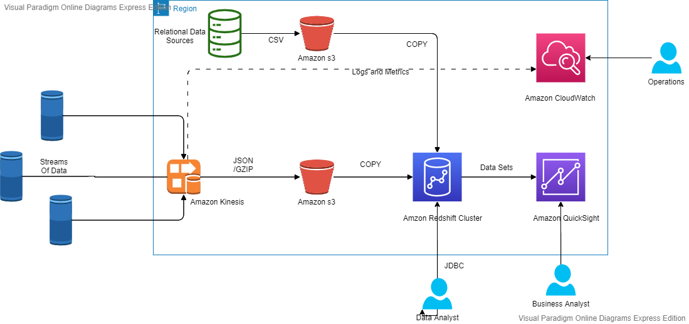

# Analyse de données en continu avec Amazon Kinesis Data Firehose, Amazon Redshift et Amazon QuickSight

Dans l'article suivant, nous démontrerons l'utilisation d'Amazon Kinesis Data Firehose, Amazon Redshift et Amazon QuickSight pour analyser les données de streaming. Nous simulerons des données de séries chronologiques, en streaming depuis un ensemble de capteurs IoT vers Kinesis Data Firehose. Kinesis Data Firehose écrira les données IoT dans un Amazon S3 Data Lake, où elles seront ensuite copiées vers Redshift en temps quasi réel. Dans Amazon Redshift, nous améliorerons les données du capteur en continu avec les données contenues dans l'entrepôt de données Redshift, qui ont été rassemblées et dénormalisées dans un schéma en étoile.

Ref: [Streaming Data Analytics with Amazon Kinesis Data Firehose, Amazon Redshift, and Amazon QuickSight](https://github.com/garystafford/kinesis-redshift-streaming-demo).

## Architecture

